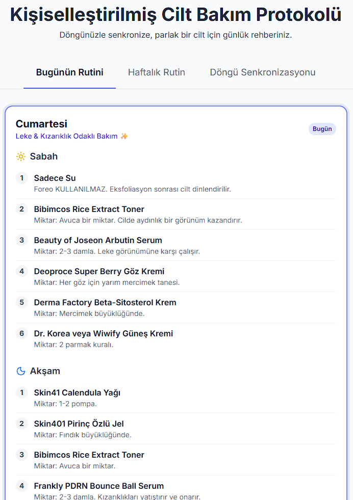

# AI İLE KOD YAZMADAN KARMAŞIK BİR RUTİNİ NASIL DİJİTALLEŞTİRDİM?

Merhaba,

Banyodaki kozmetik kaosunu tek bir satır kod yazma sürecine girmeden yapay zeka ile nasıl kişisel bir cilt bakım uygulamasına dönüştürdüğümü anlatmak istiyorum.

Cilt bakımım sırasında yeni ürünleri keşfetmeyi ve bunları rutinime entegre etmeyi seviyorum, ancak fark ettim ki bir süre sonra ürün sayısı arttıkça işler karışmaya başladı. Hangi gün hangi serumu kullanacağımı, aktif içeriklerin birbiriyle çakışıp çakışmadığını ya da o hafta yeterli rutini tamamlayıp tamamlamadığımı takip etmekte zorlanmaya başlamıştım. Aklımda hep "Acaba bugün hangi üründü?", "Bu ürünle şu ürünü kullansam uyumlu olur mu?" ya da "Bu ürünü bu hafta iki kez kullanmış mıydım?" gibi sorular oluyordu. Ben de bu karmaşaya bir son vermek için yapay zekadan destek almaya, kendi dijital rehberimi yaratmaya karar verdim. 

## 🌪️ **Kaos Sürecinden Planlamaya**

Sürece elimdeki tüm ürünleri bir listede toplamaya ve bu listeyi yapay zekaya vermekle başladım. Temizleyiciler, tonikler, serumlar… Elimdeki her kategoriden ürünümü ekledim listeme. Cilt bakımına hakim olmayan biri için bu liste sadece bir "kozmetik yığını" gibi görünebilir; ancak yapay zekaya bu listeyi verdiğimde, ona sadece ürün isimlerini değil, bir mantık çerçevesi sundum. 

> "İşte tüm ürünlerim ve cilt tipim (hassas, karma, lekelenmeye yatkın). Bana bir cilt bakımı planı oluştur, bu planda ürünler birbirlerinin etkisini bozmasın ve her günün bir odağı (dinlenme, yenilenme, onarım gibi) olsun."

Yapay zeka burada ürünlerimi analiz etti, aktif içerikleri belirledi ve haftanın günlerine dağıttı. Her ürünü her güne tıkıştırmak yerine, rutine uygun, cildi yormayan, mantıksal bir sıralama oluşturdu. Örneğin, pazartesi gününü "Nem & Bariyer Onarım" günü yaparak bu rutine uygun ürünleri pazartesiye yerleştirirken, perşembe gününü "Cilt Yenileme (Retinal Gecesi)" gibi temalarla ayırdı. Bu sayede artık elimde rastgele bir liste değil, mantıksal bir yapıya sahip bir rutin vardı.

## 🔄 **Listeden Dinamik Yapıya Geçiş**

Planım hazırdı ama temelde hala düz bir sayfaydı. Bu planı dinamik bir web uygulamasına dönüştürmem gerekiyordu. Bunu bir web uygulamasına dönüştürmesini istediğimde, AI bana ilk başta her şeyin tek bir sayfada toplandığı upuzun bir yapı sundu. Düşünün elinizde bir kılavuz var ama tüm sayfalar dev boyutta tek bir kağıda basılmış ve aradığınızı bulmak için sürekli aşağıya kaydırmanız gerekiyor. Elimde olan sonuç (`index.html`) görsel olarak tatmin ediciydi, ancak kullanışlı değildi. Bu noktada veriyi ve görünümü birbirinden ayırmamız gerekiyordu; yani rutin bilgilerimi ana sayfamızdan (`index.html`) ayırıp ayrı bir veri dosyasına (`data.js`) taşımalıydık. Bu hamle sayesinde sadece işimizi kolaylaştırmakla kalmayıp ek olarak yapay zekanın da çalışma verimliliğine katkıda bulunacaktık. Bir değişiklik istediğimizde yapay zeka tüm sitenin kodlarını baştan sona okumaya gerek duymayacaktı. Odağını sadece ürünlerin olduğu veri dosyasına (`data.js`) sağlayarak süreci hızlandırmış ve sonuçları daha hatasız bir hale getirebilecektik.

- **Teknik Basitleştirme (Mutfak Örneği):** Uygulamayı bir restoran gibi düşünün. `index.html` dediğimiz şey restoranın masaları ve dekorasyonudur, yani görünümdür. `data.js` ise mutfaktaki malzemelerdir, yani verimiz oluyor. Eğer tüm ürün listemi masaların üzerine yığarsak, kaos olur. Ben yapay zekadan veriyi ve görünümü ayırmasını istedim; malzemeler mutfakta düzenli dursun, biz sadece o günün yemeğini masaya getirelim.

Bu ayrım sayesinde, yani `data.js` dosyasını oluşturduğumuzda, uygulama daha kullanışlı bir hale geldi. Bu sayede hangi gündeysek, uygulama karşıma o günün menüsünü getiriyordu. Ayrıca bu sayede bir ürünüm bittiğinde veya değiştiğinde tüm kodla uğraşmak yerine sadece "mutfaktaki" (`data.js`) o satırı güncelleyerek kolaylıkla rutinimi güncellemiş oluyordum.

## 🌸 **Döngü Senkronizasyonu ile Kişiselleştirme**

Döngü ile senkronize olan bir rutinin gözden kaçan bir nokta olduğunun farkındaydım. Cildimin her hafta aynı olmadığını biliyordum; bazen yorgun, bazen hassas, bazen kızarıktı. Rutinin buna uyum sağlaması gerekiyordu. Yapay zekaya cilt bakımımı döngü senkronizasyonuna göre uyarlamasını istedim. AI, elimdeki malzemelerin o haftalık uygunluğunu analiz ederek bana o hafta cildimin neye ihtiyaç duyabileceğini ve hangi günlere ekstra dikkat etmem gerektiğini gösteren net bir yol haritası çıkardı. Bu sayede cildimin değişen ihtiyaçlarını öngörüp rutinimde önem vermem ve dikkat etmem gerekenleri biliyordum.

Sayfamın en sevdiğim kısımlarından biri de biten veya yeni eklenen ürünlere göre yapay zekayı yönlendirerek, rutinime en uygun versiyonu anında oluşturabilmemizdi. Örneğin, *"Cildimin çok hassaslaştığı bir dönemdeyim, bu hafta aktif içerikleri azaltıp bariyer onarımına odaklanan bir düzenleme yapalım"* dediğimde, yapay zeka kişisel bir asistan gibi davranarak tüm haftanın planını cildimi yormayacak şekilde yeniden oluşturdu. Oluşturduğumuz düzende mutfaktaki malzemeleri (`data.js`) güncelleyerek rutini kolaylıkla yeniden oluşturabildim.

## 🏗️ **Sonuç: Kendi Çözümünün Mimarı Olmak**

Sonuç olarak elimdeki o karışık ürün kaosu rutinimi düzende tutmamı sağlayan kişisel bir web sayfasına dönüştü. Web sayfama göz atmak isterseniz **[buradan](https://gizemyurdagul.github.io/Skincare-App/)** ulaşabilirsiniz. Bu süreçte yapay zeka benim yerime kod yazan, rutinimi düzenleyen ve fikrimi elle tutulur bir sonuca ulaşmasını sağlayan bir ekip arkadaşı oldu. Umarım benim bu küçük projem sizin de kendi fikirlerinizi hayata geçirmeniz için bir ilham kaynağı olur. 

Bu fikirle yola çıkarak hazırladığım **"Yapay Zeka Destekli Kişiselleştirilmiş Cilt Bakım Rutini Asistanı"** projeme de en kısa zamanda **[portfolyomdan](https://gizemyurdagul.com)** ulaşabilirsiniz.

