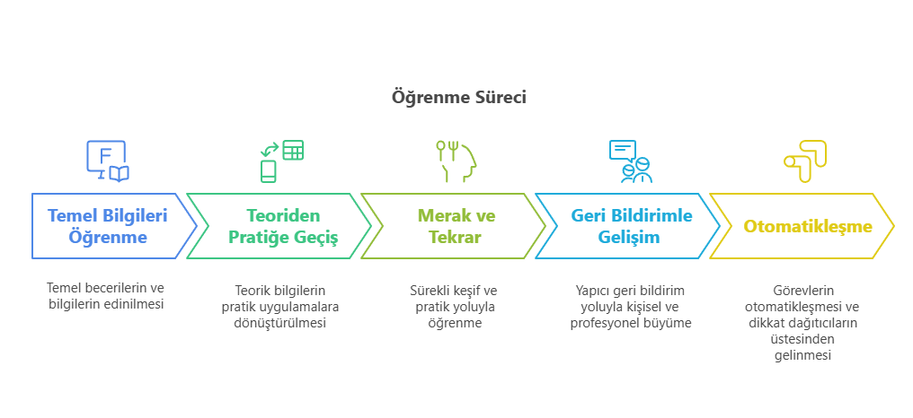
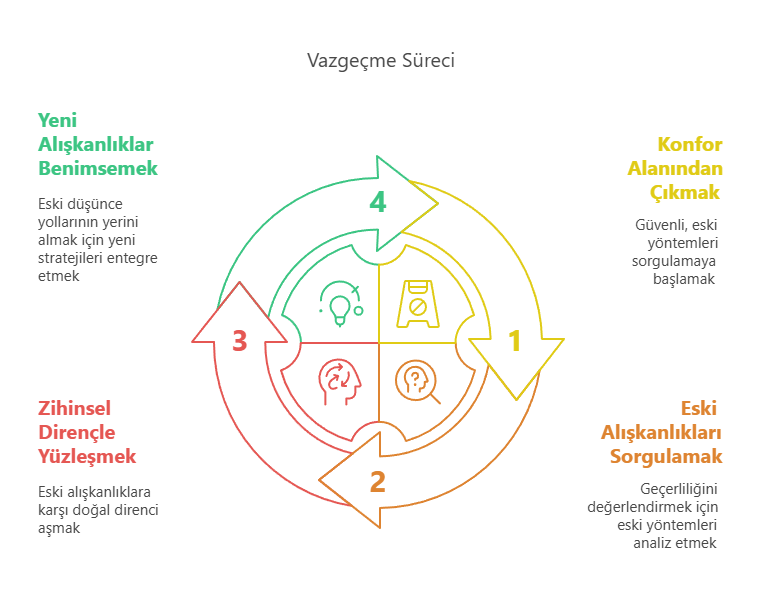

Merhaba,

Bu yazımda sizlere bugün katıldığım Microfon'un Akbank Gençlik Akademisi iş birliği ile düzenlemiş olduğu Yeni Nesil Yetkinlikler ve Sürekli Öğrenme 101 eğitiminin ilk gününde, eğitmen Emre Başkan'ın anlatımından çıkarımlarımı paylaşmak istiyorum.

Hangi alanda çalışıyor olursak olalım sürekli gelişmekte olan teknoloji, yapay zeka ve değişen koşulların karşısında sabit kalan tek şey değişimin kendisi. Tıpkı eğitimde de söylendiği gibi: "Diploma, üzerinde son kullanma tarihi yazmayan ama bayatlayabilen bir belge." Bu yüzden artık sadece öğrenmek değil, gerektiği öğrendiklerimizi değiştirebilip yeniden öğrenebilmek önemli bir yetkinlik. Bu eğitimde çokça konuşulan bu üç kavramdan — Learn, Unlearn, Relearn — somut bir örnekle bahsetmek istiyorum : Bisiklet sürmek gibi.

🎥 **Ters Gidonlu Bisiklet**

Bu eğitimde izlediğim, sizlere bahsedeceğim deney, yeniden öğrenmenin zihinsel süreçlerini oldukça iyi açıklıyor: 25 yıldır bisiklete binen bir adam, küçük bir değişiklikle karşılaşıyor: Gidonu sağa çevirdiğinde bisiklet sola, sola çevirdiğinde ise sağa dönüyor. Yani bildiği ve 25 yıldır yaptığı her şey tersine dönüyor. Bu küçük değişiklik, adamın reflekslerini tamamen işe yaramaz hale getiriyor. Bisiklet sürmeyi bilen biri olarak başta başaracağına emin olsa da defalarca düşüyor. Her gün sadece 5 dakikalık tekrarlarla yeni alışkanlıklarını inşa ediyor. Bu şekilde bildiği bir beceriyi yeniden öğrenmesi tam 8 ay sürüyor. Ama deney burada bitmiyor. 8 ay sonra yeniden eski yani normal bisikletine bindiğinde yalnızca 20 dakikada eski alışkanlığına geri dönebiliyor. Bu da, beynin hem ne kadar öğrenebilir olduğunu hem de eski yapıya dönmeye ne kadar meyilli olduğunu gösteriyor. Yani bir alışkanlık ne kadar uzun süre tekrarlanmış, yapılmışsa onu değiştirmek de o kadar fazla tekrar ve bilinç gerektiriyor.

Şimdi bu öğrenme sürecine adım adım göz atalım :

**Learn (Öğrenmek): Temeli Oluşturmak**

Her yeni başlangıç bir öğrenme süreciyle başlar. Bu, ister ilk iş günü olsun ister yeni bir alana geçiş, kişi önce temel bilgileri ve becerileri kazanır.

- Teoriden pratiğe geçiş: Üniversitede öğrendiğimiz yöntemlerin ne kadar iyi öğrenmiş olsakta gerçek iş dünyasında hız, iletişim ve sonuç odaklılıkla nasıl değiştiğini gözlemlemek ve tecrübe kazanmak önemli bir farkındalık yaratır.
- Merak ve tekrar: Yeni konulara ilgi duymak, soru sormaktan çekinmemek, hata yaparak ilerlemek öğrenme sürecinin adımlarıdır.
- Geri bildirimlerle gelişim: Ekip arkadaşları ve/veya yöneticilerden alınan yapıcı geri bildirimler, öğrenmeyi pekiştirir ve yön verir.

Learn yani öğrenme aşaması, bireyin işi "nasıl yapacağını" kavradığı, temel reflekslerini oluşturduğu dönemdir.
Ancak değişen koşullarla birlikte bu bilgiler bir süre sonra yetersiz hale gelebilir.
Tıpkı bisiklet sürmeyi ilk öğrendiğimizde olduğu gibi…
İlk başta dikkatimizin tamamı pedallarda, dengede ve direksiyondadır.
Ne yapacağımızı bilinçli şekilde düşünerek uygularız. Zihnimiz o anda tamamen öğrenmeye odaklıdır. Bu süreç tekrarlandıkça, bilgiler sinapslarla bağlanır ve otomatik reflekslere dönüşür.
Bu sayede artık bisiklet sürerken müzik dinleyebilir, çevreye bakabiliriz.

**Unlearn (Vazgeçmek): Eskiyi Bırakmak**

Öğrendiklerimizin bazıları bir süre sonra yeni çıkan teknolojiler, sistemler içinde verimsiz hale gelebilir. Bu noktada devreye "unlearn" kavramı girer:
Yani öğrendiğimiz bir yaklaşımı ya da davranışı aktif şekilde sorgulamak ve gerektiği zaman terk etmek.

- Konfor alanından çıkmak: Alıştığımız yöntemler güvenli gelir. Ancak gelişen teknoloji vb. ile yeni araçlar, yöntemler veya stratejiler bu konforu bozabilir. Örneğin manuel hazırlanan bir rapor, otomasyon araçlarıyla daha hızlı ve hatasız yapılabilir hale gelir.
- Eski ezberleri sorgulamak: Daha önce "doğru" olan bir yaklaşım, değişen koşullarda artık geçerli olmayabilir. Bu, zihinsel bir esneklik gerektirir.
- Zorluğu nerede?: Beynimiz, alışkanlıklar üzerinden enerji tasarrufu sağlar. Bu nedenle eski bilgileri bırakmak, yeni bir şey öğrenmekten daha zordur. Burada ego, kontrol arzusu ve direnç devreye girebilir.

Unlearn, bilgiyi silmek değil, güncellenmeyen yapının artık gelişimi engellediğini fark etmek demektir. Bunu bisiklet sürmeyle örnekleyelim… Eğitimde anlatıldığı gibi, gidonu sağa çevirdiğinizde sola dönen bir bisiklete binmek zorunda kalsanız ne olur? 25 yıldır refleks haline gelmiş hareketler artık işe yaramaz.
Zihniniz, eski bilgilerle yeni durumu çözmeye çalışır, ama başarısız olur.
İşte bu tam anlamıyla unlearn sürecidir:
Eski alışkanlıklar artık işlevsizdir, ancak beyin onları terk etmeye karşı ciddi direnç gösterir. Zihnimiz yeni düzene uyum sağlamaya çalışırken eski bilgilerle çözüm üretmeye devam eder. Unlearn, bilgiyi silmek değil; artık işe yaramayan düşünce yollarının yerine yenilerini koymaya karar vermektir.
Ve bu, çoğu zaman öğrenmekten çok daha fazla zihinsel çaba gerektirebilir.

**Relearn (Yeniden Öğrenmek): Güncellemek ve Genişletmek**

Vazgeçilen eski bilgi ve yöntemlerin yerine daha güncel, daha etkili olanların eklenmesiyle "yeniden öğrenme" süreci başlar.

- Mevcut temelin üzerine inşa: Bu süreç sıfırdan başlamak değildir. Temel zaten vardır; önemli olan onu yeni bilgilerle desteklemek ve güncellemektir.
- Adaptasyon: Örneğin, klasik bir ofis programının yeni sürümünü kullanmak, farklı bir yazılım diline geçmek ya da değişen iletişim tarzlarına uyum sağlamak bu sürecin parçasıdır.
- Bilinçli öğrenme: İlk öğrenme çoğunlukla keşfetmeye dayalı ve farkında olmadan gerçekleşirken, yeniden öğrenme süreci daha bilinçli kararlar almayı ve amaca yönelik hareket etmeyi gerektirir.
- Gelişim etkisi: Yeniden öğrenme sayesinde birey sadece görevini yerine getiren biri olmaktan çıkar; daha hızlı karar alabilen, karmaşık süreçleri yöneten, stratejik katkılar sunabilen bir profesyonele dönüşür.

Relearn, bilginin üzerine ekleme değil, bazen silineni yeniden yazmaktır.
