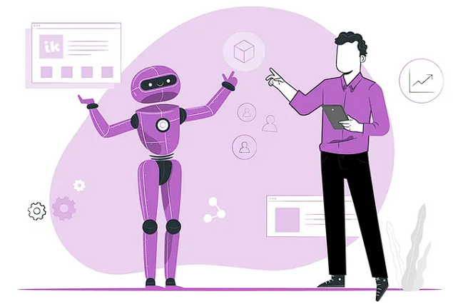
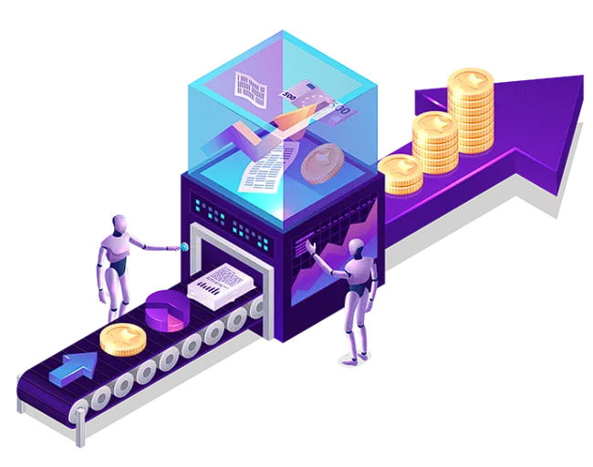

Merhaba arkadaşlar. Bugün sizlere yapay zekanın ürün yönetimindeki kullanım alanlarından sonrasında yapay zekayı ürün yönetiminde kullanmanın avantajlarından ve dezavantajlarından, ardından yapay zeka destekli ürün yönetimi örneklerinden son olarak yapay zeka ve ürün yönetiminin gelecekteki rolünden bahsedeceğim.

Yapay zekanın ürün yönetimindeki kullanım alanları nelerdir? Öncelikle yapay zeka nedir kısaca bahsedeyim. Yapay zeka yani artificial intelligence en basit şekilde belirli görevleri yerine getirmek için insan zekasını taklit eden ve topladıkları bilgileri yineleyerek kendilerini geliştirebilen sistemler olarak tanımlanır. Yapay zekayı günümüz teknoloji sistemlerinden ayıran en önemli özellik insan zekasını taklit edebilmesidir. Bu sistem, var olan durumları gözlemleyerek daha önceden belirlenen parametreler doğrultusunda ilgili durumu işler ve buna yönelik bir tepki verir. Bu süreçte, yapay zeka duruma ilişkin verileri hızlı, yinelemeli ve akıllı algoritmalarla birleştirilerek işler. Yapay zekanın ürün yönetimindeki alanlarından bahsedecek olursak :

- **Ürün Tasarımı:** Yapay zeka, tasarım sürecinde insanların yaptığı işlemleri otomatikleştirerek, tasarımcılara yardımcı olabilir. Örneğin, yapay zeka teknolojisi, tasarımcıların fikirlerini daha hızlı bir şekilde prototip haline getirerek, ürün geliştirme sürecini hızlandırabilir.
- **Ürün Pazarlaması:** Yapay zeka, reklam hedeflemesi, müşteri analizi ve pazarlama stratejileri gibi alanlarda kullanılabilir. Yapay zeka tabanlı bir pazarlama sistemi, müşterilerin davranışlarına göre özelleştirilmiş reklam kampanyaları oluşturarak, müşteri deneyimini artırabilir.
- **Müşteri Hizmetleri:** Yapay zeka, müşteri hizmetlerinde kullanılarak, müşteri taleplerine daha hızlı yanıt verilebilir. Örneğin, yapay zeka tabanlı bir müşteri hizmetleri sistemi, müşteri şikayetlerini otomatik olarak analiz ederek, en uygun çözümü önerir.
- **Stok Yönetimi:** Yapay zeka, stok yönetiminde kullanılarak, stok seviyelerinin daha etkili bir şekilde yönetilmesine yardımcı olabilir. Yapay zeka tabanlı bir stok yönetim sistemi, tedarik zincirindeki verileri analiz ederek, stok seviyelerini optimize eder.
- **Ürün Öneri Motorları:** Yapay zeka, müşteri davranışlarına dayanarak kişiselleştirilmiş ürün önerileri sunan sistemlerin geliştirilmesinde kullanılabilir. Bu sistemler, müşterilerin ilgilendikleri ürünleri daha hızlı bir şekilde bulmalarını sağlayarak, müşteri deneyimini artırır.
- **Kalite Kontrolü:** Yapay zeka, ürün kalitesinin kontrol edilmesinde kullanılabilir. Örneğin, yapay zeka tabanlı bir görüntü işleme sistemi, ürünlerin kalitesini görsel olarak analiz ederek, hataları tespit edebilir.

Yapay zeka, ürün yönetimi süreçlerinde birçok avantaj sağlayabilir. Peki yapay zekanın ürün yönetimindeki avantajları nelerdir ? Bu avantajlardan bahsedecek ve örneklendirecek olursak:

- **Verimlilik:** Yapay zeka, ürün yönetimi süreçlerini otomatikleştirerek, verimliliği artırabilir. Örneğin, bir e-ticaret şirketi, yapay zeka teknolojisi kullanarak, müşteri taleplerini otomatik olarak yönlendirebilir ve müşteri hizmetleri sürecini hızlandırabilir.
- **Kişiselleştirme:** Yapay zeka, müşteri davranışlarını analiz ederek, kişiselleştirilmiş ürün ve hizmetler sunabilir. Örneğin, bir müzik uygulaması, yapay zeka teknolojisi kullanarak, müşterilerin dinleme geçmişlerine göre kişiselleştirilmiş müzik önerileri sunabilir.
- **Kalite Kontrolü:** Yapay zeka, ürün kalitesini kontrol ederek, hataları tespit edebilir. Örneğin, bir otomobil üreticisi, yapay zeka teknolojisi kullanarak, üretim hattında oluşabilecek hataları tespit edebilir.
- **İnovasyon:** Yapay zeka, ürünlerin geliştirilmesinde yeni fikirler ve yaklaşımlar sunabilir. Örneğin, bir giyim markası, yapay zeka teknolojisi kullanarak, müşterilerin beden ölçülerine göre özelleştirilmiş kıyafetler üretebilir.
- **Stok Yönetimi:** Yapay zeka, tedarik zincirindeki verileri analiz ederek, stok seviyelerini optimize edebilir. Örneğin, bir perakende mağazası, yapay zeka teknolojisi kullanarak, mevsimsel değişiklikler ve müşteri talepleri gibi faktörlere göre stoklarını yönetebilir.
- **Veri Analizi:** Yapay zeka, ürün yönetimi sürecinde kullanılan verileri analiz ederek, daha iyi kararlar alınmasına yardımcı olabilir. Örneğin, bir banka, yapay zeka teknolojisi kullanarak, müşteri verilerini analiz ederek, en uygun kredi tekliflerini sunabilir.

Bu avantajlar, yapay zekanın ürün yönetimi süreçlerinde sağladığı faydaları göstermektedir. Yapay zeka, ürün yönetimi süreçlerinde birçok farklı alanda kullanılarak, ürünlerin daha etkili bir şekilde yönetilmesine ve müşteri memnuniyetinin artırılmasına katkı sağlayabilir.

Yapay zeka, ürün yönetimi süreçlerinde birçok avantaj sağlarken, bazı dezavantajları da bulunmaktadır. Dezavantajlarından bahsedecek olursak :

- **Yüksek Maliyet:** Yapay zeka teknolojisi, geliştirilmesi ve uygulanması oldukça maliyetlidir. Bu nedenle, küçük işletmeler veya yeni başlayan girişimler, yapay zeka teknolojisini kullanmak için yeterli bütçeye sahip olmayabilir.
- **Veri Güvenliği:** Yapay zeka, verilerin işlenmesi ve analiz edilmesi sürecinde, kişisel verilerin güvenliği konusunda endişeler yaratabilir. Örneğin, bir banka müşterisinin kişisel verileri, yapay zeka teknolojisi kullanılarak işlenirken, bu verilerin güvenliği konusunda endişeler oluşabilir.
- **Yanlış Kararlar:** Yapay zeka, verilerin işlenmesi ve analiz edilmesi sürecinde, yanlış kararlar alabilir. Örneğin, bir algoritma, bir işletmenin müşterilerine uygun olmayan ürünleri önererek, müşteri memnuniyetsizliği ve kayıplara neden olabilir.
- **Etik Sorunlar:** Yapay zeka, bazı etik sorunlar yaratabilir. Örneğin, bir yapay zeka algoritması, cinsiyet, ırk, din gibi özelliklerden dolayı ayrımcılık yapabilir ve bu durum etik sorunlara neden olabilir.
- **Güvenlik Sorunları:** Yapay zeka, kötü niyetli kullanıcıların saldırılarına karşı savunmasız olabilir. Örneğin, bir yapay zeka algoritması, kötü niyetli kullanıcılar tarafından yanlış verilerle eğitilerek, kötü amaçlı işlemler için kullanılabilir.
- **İnsan İletişimi:** Yapay zeka, insanlarla iletişimde bazı sınırlamaları bulunabilir. Örneğin, bir müşteri hizmetleri chatbotu, insanların karmaşık problemlerini çözmek için yeterli değilse, müşteri memnuniyetsizliği yaratabilir.

Bu dezavantajlar, yapay zekanın ürün yönetimi süreçlerinde karşılaşılan sorunları göstermektedir. Yapay zeka teknolojisi, bazı etik sorunlar, veri güvenliği, yanlış kararlar ve insan iletişimi gibi dezavantajlarla karşı karşıya kalabilir. Bu nedenle, yapay zekanın etik, güvenlik ve kullanımı konularında titizlikle ele alınması gerekmektedir.

Yapay zeka destekli ürün yönetimi, birçok sektörde kullanılmaktadır. İşte farklı sektörlerden yapay zeka destekli ürün yönetimi örnekleri:

- **E-ticaret:** E-ticaret platformları, yapay zeka teknolojisi kullanarak, müşterilerin tercihlerine göre ürünler önerir. Amazon, yapay zeka algoritmaları kullanarak müşterilerin alışveriş tercihlerini analiz ederek, ürünler önermektedir.
- **Finans:** Finans sektöründe, yapay zeka teknolojisi kullanarak, kredi riski analizi ve sahtekarlık tespiti yapılabilir. Yapay zeka algoritmaları, bankaların kredi başvurularını analiz ederek, kredi riskini hesaplamakta ve sahtekarlık tespiti yapmaktadır.
- **Sağlık:** Sağlık sektöründe, yapay zeka teknolojisi kullanarak, hastalıkların teşhis edilmesi ve tedavi planlarının hazırlanması mümkündür. Yapay zeka algoritmaları, hastaların tıbbi verilerini analiz ederek, hastalıkların teşhis edilmesinde ve tedavi planlarının hazırlanmasında yardımcı olmaktadır.
- **Otomotiv:** Otomotiv sektöründe, yapay zeka teknolojisi kullanarak, araçların sürüş performansı ve güvenliği artırılabilir. Yapay zeka algoritmaları, araçların sürüş verilerini analiz ederek, sürüş performansını artırmakta ve güvenliği sağlamaktadır.
- **Tarım:** Tarım sektöründe, yapay zeka teknolojisi kullanarak, ürün verimliliği artırılabilir. Yapay zeka algoritmaları, toprak verilerini analiz ederek, toprağın özelliklerine göre sulama, gübreleme ve hasat planlaması yaparak, ürün verimliliğini artırmaktadır.
- **Üretim:** Üretim sektöründe, yapay zeka teknolojisi kullanarak, üretim süreçleri optimize edilebilir. Yapay zeka algoritmaları, üretim süreçlerindeki verileri analiz ederek, üretim planlamasını optimize eder ve üretim sürecinin verimliliğini artırır.

Bu örnekler, farklı sektörlerde yapay zeka destekli ürün yönetimi uygulamalarını göstermektedir. Yapay zeka teknolojisi, ürün yönetimi süreçlerinde birçok avantaj sağlamaktadır ve farklı sektörlerde birçok uygulama alanı bulunmaktadır.

Yapay zeka teknolojisi, son yıllarda hızla gelişmiş ve birçok sektörde kullanılmaya başlamıştır. Ürün yönetimi süreçleri de bu teknolojinin avantajlarından faydalanmaya başlamıştır. Yapay zeka teknolojisi, ürün yönetimi süreçlerinde verimlilik, müşteri memnuniyeti ve karlılık gibi birçok avantaj sağlamaktadır. Gelecekte, yapay zeka ve ürün yönetimi birbirleriyle daha da entegre hale gelecektir.

Yapay zeka teknolojisinin gelecekte ürün yönetimi süreçlerinde oynayacağı rol ile ilgili birçok tahmin ve öngörü bulunmaktadır. İşte bazı öngörüler:

- **Ürün tasarımı:** Yapay zeka teknolojisi, ürün tasarımı süreçlerinde daha fazla kullanılacak ve tasarım sürecindeki insan hatalarının azaltılmasına yardımcı olacaktır.
- **Ürün önerileri:** E-ticaret platformları, yapay zeka algoritmaları kullanarak, müşterilerin alışveriş alışkanlıklarını analiz ederek daha iyi ürün önerileri sunacaktır.
- **Müşteri hizmetleri:** Yapay zeka teknolojisi, müşteri hizmetleri süreçlerinde daha fazla kullanılacak ve müşteri sorularına hızlı ve doğru cevaplar verilecektir.
- **Ürün optimizasyonu:** Yapay zeka teknolojisi, ürün optimizasyonu süreçlerinde daha fazla kullanılacak ve ürünlerin özellikleri, maliyetleri ve satış performansları gibi verileri analiz ederek, ürünlerin daha verimli bir şekilde yönetilmesine yardımcı olacaktır.
- **Satış tahminleri:** Yapay zeka teknolojisi, satış tahminleri süreçlerinde daha fazla kullanılacak ve satış trendleri, mevsimsel faktörler ve rekabet gibi faktörleri analiz ederek, daha doğru satış tahminleri yapılacaktır.

Bu öngörüler, yapay zeka teknolojisinin ürün yönetimi süreçlerinde gelecekte oynayacağı rol hakkında fikir vermektedir. Ayrıca, IDC tarafından yapılan bir araştırmaya göre, 2021 yılında dünya çapında yapay zeka teknolojilerine 327 milyar dolar yatırım yapılmıştır. Bu veriler, yapay zeka teknolojilerinin önümüzdeki yıllarda ürün yönetimi süreçlerinde daha fazla kullanılacağını ve önem kazanacağını göstermektedir.

Özet olarak bu yazıda yapay zekanın ürün yönetimi alanındaki önemi ve kullanım alanları ele alındı. Yapay zekanın, ürün yönetiminde verimliliği artırdığı, maliyetleri azalttığı ve müşteri deneyimini geliştirdiği belirtilerek örnekler verildi. Ancak yapay zekanın dezavantajlarına da değinilerek, etik ve güvenlik sorunlarına dikkat çekildi.

Farklı sektörlerden yapay zeka destekli ürün yönetimi örnekleri sunularak, yapay zekanın günümüzde ve gelecekte ürün yönetimindeki rolü açıklandı. Özellikle büyük veri analizi ve öngörüsel analitik teknolojileriyle birleştirildiğinde, yapay zeka gelecekte ürün yönetiminde daha da önemli bir rol oynayacak.

Sonuç olarak, yapay zekanın ürün yönetiminde önemi giderek artacak ve bu alanda faaliyet gösteren şirketlerin yapay zeka teknolojilerine yatırım yapmaları gerekecek. Ancak yapay zeka kullanımının etik ve güvenlik sorunlarına da dikkat edilmesi, kullanım alanlarının sınırlandırılması ve düzenlenmesi büyük önem taşımaktadır.
